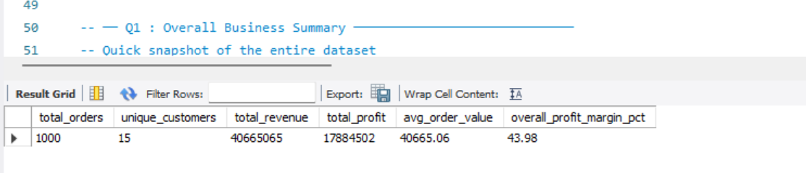
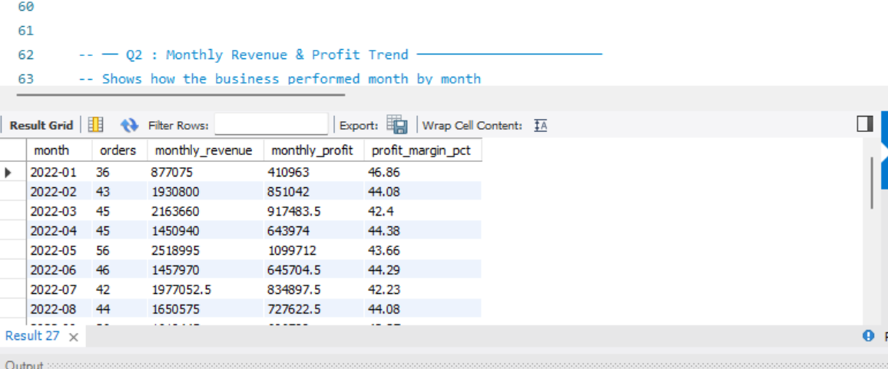
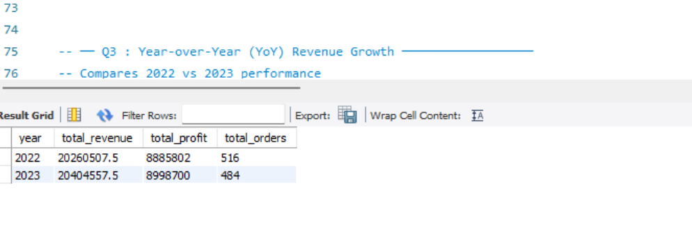

# Sales & Revenue Analysis using SQL (MySQL)

A SQL-based business analysis project on a simulated Indian retail company's sales data — 1,000 orders across 2 fiscal years (2022–2023), covering multiple product categories, customer segments, and regions. Built to practice writing real analytical SQL queries that a finance or business analyst would actually use.

## Dataset

`sales_data.csv` — 1,000 orders with the following fields:

| Column | Description |
|---|---|
| order_id | Unique order identifier |
| order_date | Date of order (2022–2023) |
| customer_id / customer_name | Customer details |
| city / region | Location (North / South / East / West) |
| segment | Customer type — Retail, Corporate, SME |
| category | Product category (Electronics, Furniture, etc.) |
| product_name | Product sold |
| quantity | Units ordered |
| unit_price / unit_cost | Price and cost per unit |
| discount | Discount applied (0 to 15%) |
| revenue | Final revenue after discount |
| profit | Final profit after discount |

## Features

- Business-oriented SQL analysis
- Revenue and profit trend analysis
- Customer segmentation
- Regional performance comparison
- Product profitability analysis
- Window Functions for cumulative revenue
- Year-over-Year and Quarter-wise growth analysis

## Queries Written (analysis.sql)

12 analytical queries covering real business questions:

1. **Overall Business Summary** — total revenue, profit, avg order value, margin
2. **Monthly Revenue & Profit Trend** — how the business moved month by month
3. **Year-over-Year Growth** — 2022 vs 2023 revenue and profit comparison
4. **Region-wise Performance** — which geography contributes most to revenue
5. **Category-wise Analysis** — most and least profitable product categories
6. **Top 10 Products by Revenue** — best-selling products with margin breakdown
7. **Customer Segment Analysis** — Retail vs Corporate vs SME comparison
8. **Top 10 Customers** — highest-value customers by total revenue
9. **Discount Impact Analysis** — whether discounts help or hurt profitability
10. **Running Total Revenue** — cumulative growth using Window Functions
11. **Quarter-wise Breakdown** — Q1/Q2/Q3/Q4 revenue and profit by year
12. **Low Margin Products** — products with <20% margin flagged for review

## Key Findings

- Electronics had the highest total revenue but Office Supplies had the best profit margin due to low unit costs
- Orders with no discount generated significantly better margins than discounted orders — suggesting aggressive discounting is hurting profitability
- Corporate segment had the highest average order value despite fewer total orders compared to Retail
- Q4 consistently outperformed other quarters in both years, showing a seasonal demand spike

## How to Run

**Step 1** — Open MySQL Workbench, connect to your local server

**Step 2** — Run the first section of `analysis.sql` to create the database and table

**Step 3** — Update the file path in the `LOAD DATA LOCAL INFILE` command to wherever you saved `sales_data.csv` on your machine

**Step 4** — Run queries one by one, or select all and execute

If `LOAD DATA LOCAL INFILE` is blocked, enable it with:
```sql
SET GLOBAL local_infile = 1;
```
Or manually import the CSV via MySQL Workbench → Table Data Import Wizard (right-click the table).

## SQL Concepts Used

- `GROUP BY`, `ORDER BY`, `HAVING`
- Aggregate functions — `SUM`, `COUNT`, `AVG`, `ROUND`
- `DATE_FORMAT`, `YEAR`, `QUARTER` for time-based grouping
- `CASE WHEN` for custom bucketing (discount ranges)
- **Window Functions** — `SUM() OVER (ORDER BY ...)` for running totals
- Subqueries for percentage-of-total calculations

  ## Sample Query Outputs

### Overall Business Summary



### Monthly Revenue Trend



### Region-wise Performance


### Customer Segment Analysis


### Year-over-Year Growth



## Tools

- MySQL 8.0
- MySQL Workbench
- SQL
- CSV (Synthetic Retail Sales Dataset)
- Git & GitHub
- The project uses a synthetic retail sales dataset created for practicing business-oriented SQL analysis and reporting.

  ## Skills Demonstrated

- SQL
- MySQL
- Business Analytics
- Data Analysis
- Window Functions
- Aggregation
- Financial Reporting
